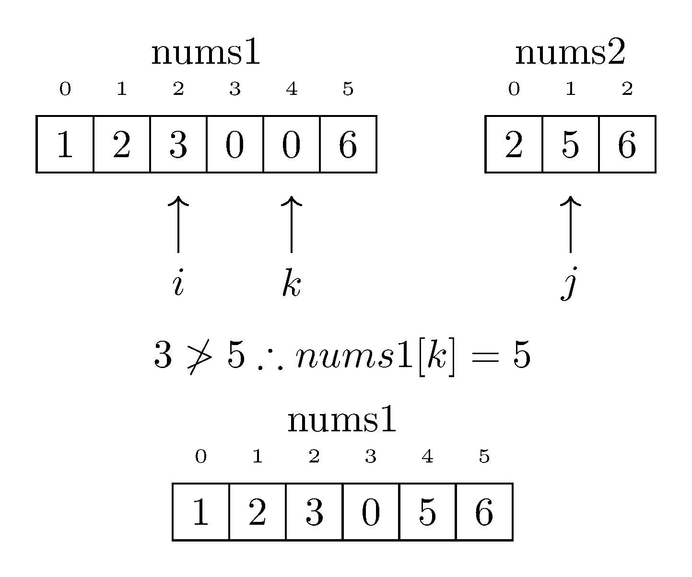
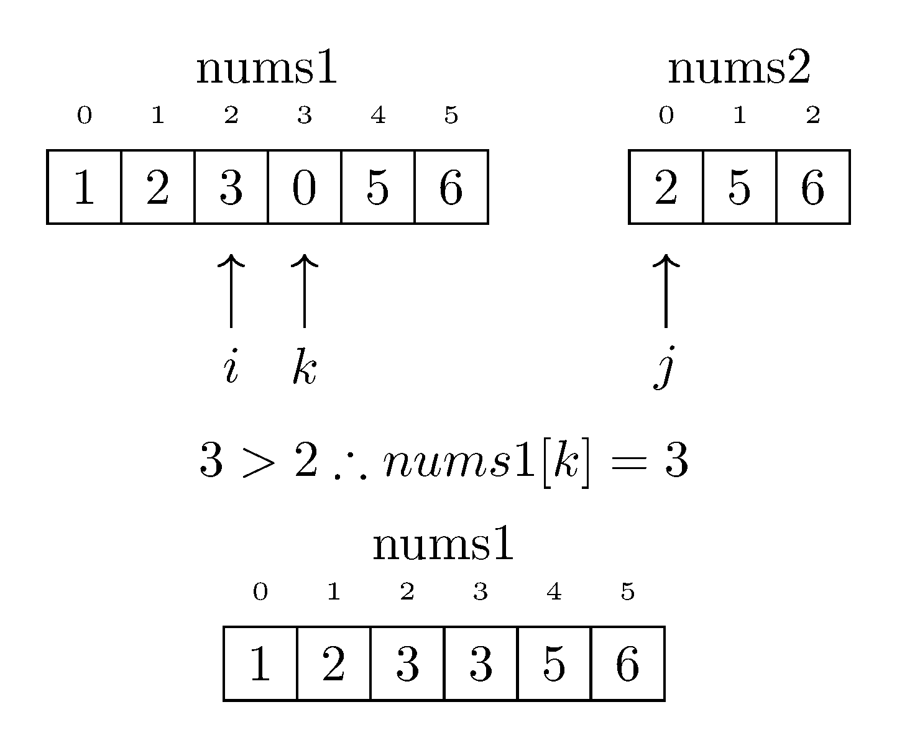

# Merge Two Sorted Arrays

This directory contains my solution to the classic problem of merging two sorted arrays into a single sorted array in an efficient manner.

## Problem Description

The challenge involves merging two sorted integer arrays, `nums1` and `nums2`.

- The arrays `nums1` and `nums2` are sorted in non-decreasing order.
- The first array, `nums1`, has a size of `m` + `n`, where `m` is the number of elements initialized in `nums1`, and `n` is the number of elements in `nums2`.
- The last `n` elements of `nums1` are set to `0` and should be ignored in the merging process.

## Constraints

- The final sorted array should not be returned by the function but instead be stored inside the array `nums1`.
- The number of elements initialized in `nums1` and `nums2` are `m` and `n` respectively.
- No additional array or data structure may be created.
- The size of `m` and `n` are both greater than or equal to `0`.
- The size of `m + n` is greater than or equal to `1`.

## Test Cases

The solution includes several test cases to ensure its correctness.

### Normal Scenarios

- Both nums1 and nums2 have multiple elements, and merging results in a correctly sorted array.
- nums1 or nums2 is larger than the other, but both have elements.

### Edge Cases

- One of the arrays (nums1 or nums2) is empty, and the other has multiple elements.
- Both arrays are empty (m and n are zero).
- All elements in nums1 are smaller than those in nums2, and vice versa.

### Special Values

- Arrays containing negative numbers.
- Arrays containing the same repeating value.

### Error Scenarios

- nums1.size() is less than m + n.
- The sum of m + n is less than 1.

## Solution

The solution to the problem of merging two sorted arrays in-place involves working backwards from the end of `nums1`, which has been sized to accommodate all elements from both arrays.
The process starts by comparing the last elements of each array, placing the larger of these two elements into the final position of `nums1`.

This comparison and placement continue, moving backwards through both arrays.
Each time, the larger of the two elements being compared is placed in the next available position from the end of `nums1`.
If elements from `nums2` are larger or if all the originally filled elements of `nums1` have been placed, they are moved into the remaining positions.

This process ensures that no existing elements in `nums1` are overwritten before they are placed in their correct position.
The merging is completed when all elements from `nums2` have been moved into `nums1`, resulting in a single, fully merged and sorted array.

### Example

Let's take the following example where nums1 = [1,2,3,0,0,0] and nums2 = [2,5,6].

#### Step 1: Initialize Pointers and Compare

To begin merging, we initialize our pointers and start comparing elements from the back of both arrays:

- i points to the last valid element in nums1, which is nums1[2].
- j points to the last element in nums2, which is nums2[2].
- k points to the last available position in nums1, which is nums1[5].

In this step, we compare nums1[2] (3) and nums2[2] (6). Since 3 is not greater than 6, we place 6 at the position indicated by k in nums1. Our nums1 array now looks like this: [1,2,3,0,0,6]. Since we placed an element from nums2, we decrement j to nums[1] (1). We also decrement k to nums1[4] to prepare for the next placement.

#### Step 2: Continue Comparing and Placing

In the next step, we continue the process:

- i points to nums1[2] (3).
- j points to nums2[1] (5).
- k points to nums1[4].

Here, we compare nums1[2] (3) and nums2[1] (5). Again, 3 is not greater than 5, so we place 5 at nums1[4]. Our nums1 array becomes [1,2,3,0,5,6]. Since we placed an element from nums2, we decrement j to nums2[0] and k to nums1[3] to prepare for the next placement.

#### Step 3: Continuing the Merge

We proceed with the merge:

- i points to nums1[2] (3).
- j points to nums2[0] (2).
- k points to nums1[3].

In this step, we find that nums1[2] (3) is greater than nums2[0] (2), so we place 3 at nums1[3]. Our array now looks like this: [1,2,3,3,5,6]. Since we placed an element from nums1, we decrement i to nums1[1] and k to nums1[2] for the next placement.

#### Step 4: Continuing the Merge

We're making progress:

- i points to nums1[1] (2).
- j points to nums2[0] (2).
- k points to nums1[2].

In this step, we find that nums1[i] (2) is not greater than nums2[j] (2), so we place nums2[j] (2) at nums1[k]. Our array is now [1,2,2,3,5,6], and we decrement j which is now out of bounds and k to nums1[1] for the next placement.

#### Step 5: Place remaining elements

We're almost there:

- i points to nums1[1] (2).
- j is out of bounds in nums2.
- k points to nums1[1].

Since j is out of bounds in nums2, we start placing the remaining elements in nums1. Though they are already in the correct location we continue with the algorithm. Specifically, we place nums1[1] (2) at nums1[1].

#### Step 6: Completing the Merge

In the final step:

- i points to nums1[0] (1).
- j is out of bounds in nums2.
- k points to nums1[0].

We continue placing the remaining elements of nums1 in place by placing nums1[0] (1) at nums1[0].

Our sorted merge is now complete, and the resulting array is [1,1,2,3,5,6].

And there you have it! You've successfully merged two sorted arrays, step by step, ensuring that the merged array remains sorted and efficiently utilizing the available space in nums1. Happy coding!
